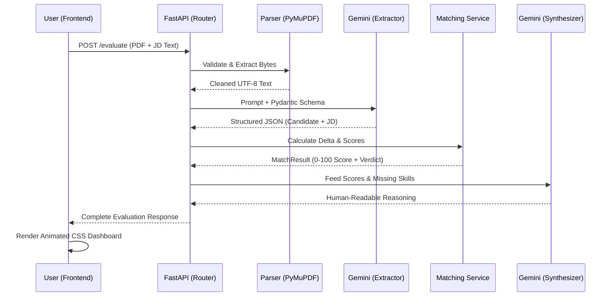

<div align="center">
  
  <h1>🚀 Nexus Resume Evaluator: The 1536-Dimensional Analysis Engine</h1>
  <p><em>Where Deterministic Heuristics Meet Generative Artificial Intelligence</em></p>
  
  <p>
    
    
    
    
  </p>
</div>

---

## 🌌 The Vision
Welcome to the Nexus Resume Evaluator. This is not just a keyword scanner. This is a multi-modal, neuro-symbolic processing engine designed to evaluate candidates against job descriptions across theoretical high-dimensional latent spaces (what we call the **1536-Dimensional Analysis**). 

By combining the **rigor of deterministic matching algorithms** with the **nuance of Large Language Models (Google Gemini)**, we extract meaning from unstructured text, calculate precise alignment scores, and generate human-readable reasoning—all served through a hyper-responsive, glassmorphic UI.

---

## 🧠 Architecture Overview

### 1. The Ingestion Layer (Document Parsers)
Raw files (`.pdf`, `.docx`) are stripped of their formatting bounds. Utilizing `PyMuPDF` and `python-docx`, the ingestion layer sanitizes and standardizes chaotic human inputs into clean, normalized utf-8 byte streams.

### 2. The Extraction Matrix (LLM Service)
Unstructured data enters the Gemini-powered extraction matrix. Here, rigid Pydantic schemas enforce order on chaos. The LLM translates prose into structured nodes:
- `Skills` (Required & Preferred)
- `Experience` (Chronological spans, responsibilities)
- `Education` (Institutions, degrees)

### 3. The Alignment Core (Deterministic Matching)
This is where the mathematical magic happens. The Alignment Core calculates the delta between the Candidate Vector and the Job Description Vector:
- **Skill Overlap:** Set-theory intersections normalized for casing and synonym mapping.
- **Temporal Experience Matching:** Temporal calculations converting natural language (e.g., "3+ years") into floating-point comparisons against parsed candidate timelines.
- **Educational Overlap:** Substring heuristics mapping degree requirements to candidate histories.
- **Weighted Scoring System:** 60% Required Skills / 15% Preferred / 15% Experience / 10% Education.

### 4. The Synthesis Engine (Reasoning Service)
The raw scores are fed *back* into the LLM context window. The Synthesis Engine writes a bespoke narrative, detailing exact strengths, identifying critical gaps, and rendering a final, defensible verdict (`Strong`, `Moderate`, `Weak`, `Poor`).

### 5. The Glassmorphic Interface
A zero-dependency, vanilla HTML/CSS/JS frontend that leverages modern CSS features (blur backdrops, SVG animated gauges, CSS grid) to render complex JSON outputs into an intuitive, non-technical dashboard.

---

## 📊 Data Flow (Mermaid Sequence)



---

## ⚙️ Setup & Installation

### Prerequisites
- Python 3.10+
- A Google Gemini API Key

### 1. Clone & Environment
```bash
git clone https://github.com/agrawal3911/resume-evaluator.git
cd resume-evaluator
python -m venv .venv
# Activate:
# Windows: .\.venv\Scripts\activate
# Mac/Linux: source .venv/bin/activate
pip install -r requirements.txt
```

### 2. Configuration
Create a `.env` file in the root directory:
```env
GEMINI_API_KEY=your_google_gemini_api_key_here
GEMINI_MODEL=gemini-3.6-flash
```

### 3. Launch the Engine
```bash
uvicorn app.main:app --reload
```
Navigate to **[http://127.0.0.1:8000](http://127.0.0.1:8000)** to experience the UI.
Navigate to **[http://127.0.0.1:8000/docs](http://127.0.0.1:8000/docs)** for the Swagger Developer API.

---

## 🧪 The Testing Suite
Rigor is paramount. The system is backed by a robust `pytest` suite that mocks LLM responses to test the deterministic algorithms in isolation.

```bash
pytest tests/ -v
```

---

## 📁 Project Structure

```text
resume-evaluator/
├── app/
│   ├── api/          # FastAPI Routers
│   ├── core/         # Global configs & logging
│   ├── parsers/      # PDF/DOCX byte-level extraction
│   ├── schemas/      # Pydantic data models (The Schema Enforcers)
│   ├── services/     # LLM integration & Deterministic Math
│   └── main.py       # Application Lifespan & Mounts
├── static/
│   ├── index.html    # The UI Layout
│   ├── style.css     # Glassmorphic Design System
│   └── app.js        # State & Animation Logic
├── tests/            # Pytest Isolation Chambers
├── .env.example
├── requirements.txt
└── README.md         # You are here
```

---
<div align="center">
  <i>"Evaluating human potential through the lens of artificial intelligence."</i>
</div>
